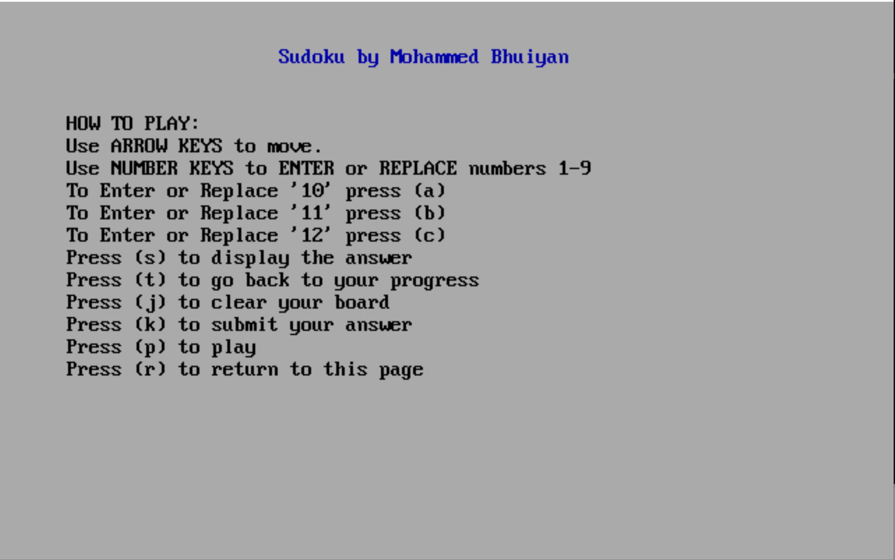
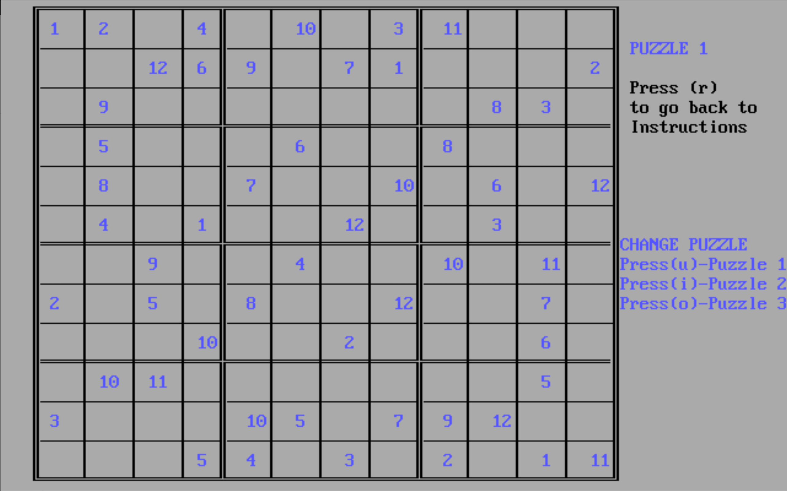
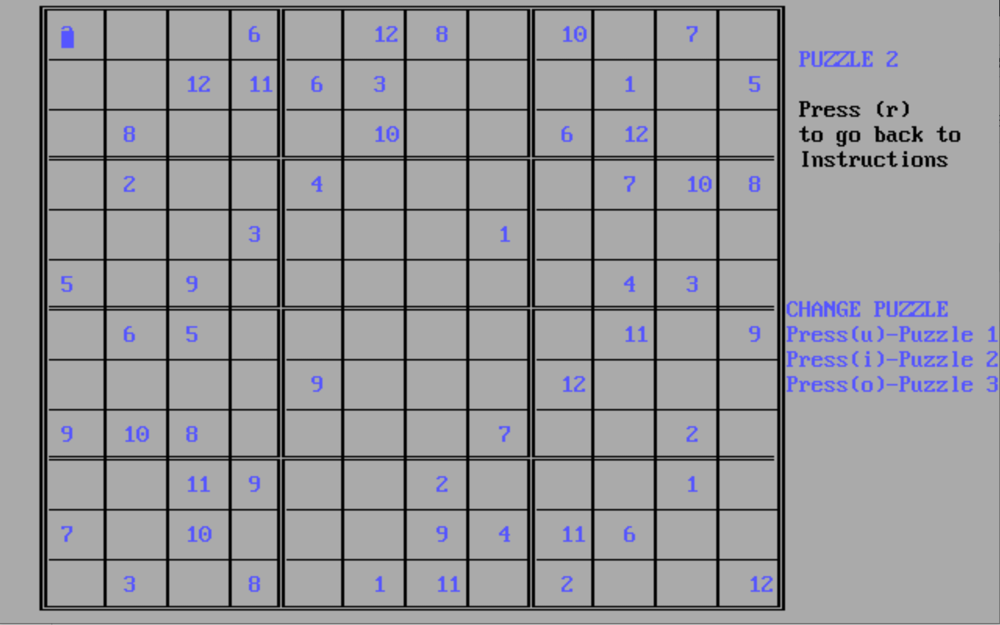
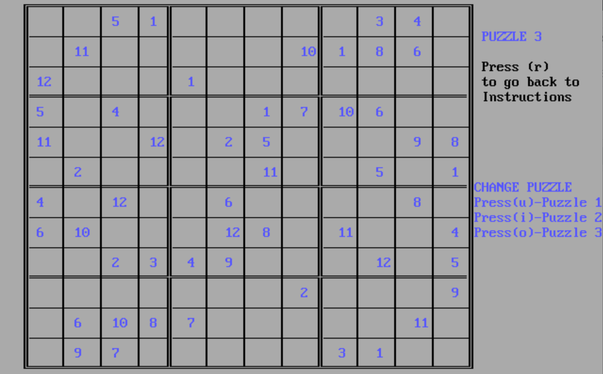

# SudokuGame
12x12 Sudoku game with three boards.

## How to compile
This can be compled using the TASM assembler.
on DosBox 
you can run these commands
- `tasm array.asm`
- `tlink array.obj`
- `array`

### Instructions

### Board 1

### Board 2

### Board 3

